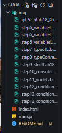

# Лабораторная работа №18: Введение в JavaScript

## Основная информация

- **ФИО:** Ханов Владислав
- **Группа:** ИСП-231
- **Дата:** 12.03.2026

## Краткое описание работы

В ходе выполнения лабораторной работы я познакомился с основами языка программирования JavaScript, его местом в веб-разработке и сравнил базовые концепции JavaScript с C#.

Были изучены следующие темы:

- Подключение JavaScript к HTML
- Переменные и типы данных
- Проверка типов с помощью typeof
- Явное и неявное преобразование типов
- Строгое и нестрогое сравнение
- Работа с консолью браузера
- Установка Node.js и запуск скриптов
- Условные операторы (if/else, switch, тернарный оператор)

## Структура проекта

